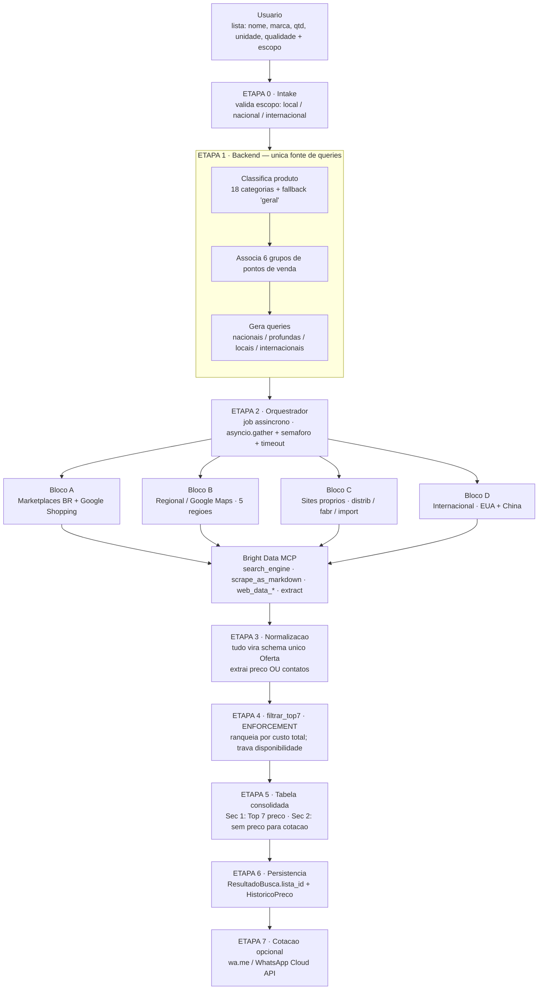
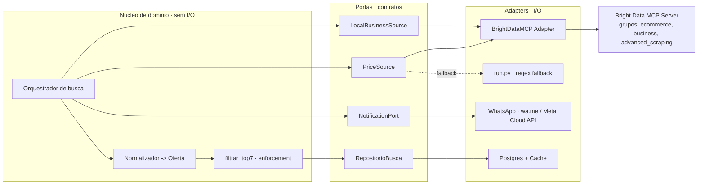
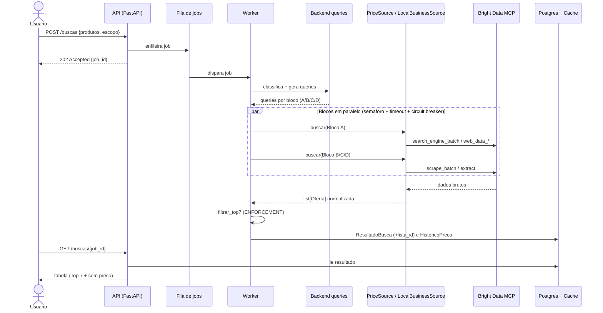
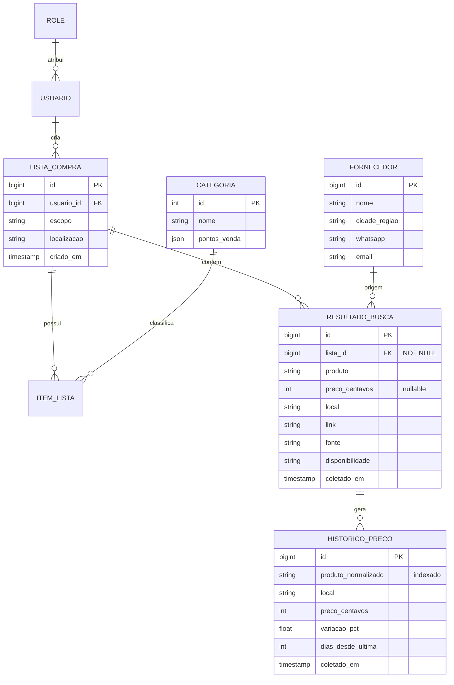

# Efraim — Documentação de Arquitetura e Lógica (v1)

Projeto: **moshe1.8 / Agente Efraim**
Escopo: agente de pesquisa de preços e fornecedores para **qualquer usuário no Brasil** (nacional), com bloco internacional (EUA + China) preservado.
Status: documento de concepção — a ser aprovado **antes** da escrita do scaffold.

---

## 1. Objetivo

Dado uma lista de produtos (`nome, marca, quantidade, unidade, qualidade`) e um escopo (`local | nacional | internacional`), o Efraim descobre **onde comprar mais barato** e **quem contatar para cotação**, entregando uma tabela consolidada de duas seções e persistindo histórico de preço.

A pesquisa de dados na web é feita por **servidores MCP** — em especial o **Bright Data MCP** — que substituem a camada de scraping manual (browserbase/Playwright/parsers por site) por um backbone único com bypass de bot, CAPTCHA e renderização de JS do lado do servidor.

---

## 2. Princípios de arquitetura

Estes princípios são inegociáveis e orientam toda decisão de implementação:

1. **MCP como backbone, atrás de portas.** O núcleo nunca conhece "Bright Data" nem "marketplace X"; conhece contratos (`PriceSource`, `LocalBusinessSource`, `NotificationPort`). O adapter primário desses contratos é o Bright Data MCP. Isso mantém MCP como cidadão de primeira classe sem acoplar a orquestração.
2. **Um ponto único de verdade para o ranking.** `filtrar_top7` é o *enforcement*. O LLM nunca reordena nem readiciona resultado descartado.
3. **Schema único de oferta.** Todo output de qualquer ferramenta MCP é normalizado para o DTO `Oferta` **no adapter**, antes de comparar. É isso que elimina duplicação de lógica de extração por site.
4. **Sem gargalo por design.** Busca é **job assíncrono** (enfileira, devolve `job_id`), com `asyncio.gather` limitado por semáforo, timeout por chamada e circuit breaker por bloco. Cache por consulta normalizada serve à latência.
5. **Manutenção primeiro.** Adapters isolados e testáveis com fakes; nada de admin/RBAC por SQL ad-hoc — apenas seed idempotente versionado.

---

## 3. Organograma da lógica (fluxo macro)



---

## 4. Arquitetura de componentes (hexagonal)

O núcleo de domínio não faz I/O. Toda comunicação externa passa por portas, implementadas por adapters intercambiáveis.



**Regra de ouro:** trocar Bright Data por outro provedor, ou plugar um MCP de WhatsApp, é trocar um adapter — sem tocar em `ORQ`, `NORMD` ou `FIL`.

---

## 5. Portas e contrato de dados

```python
# backend/app/sourcing/ports.py
from typing import Protocol

class PriceSource(Protocol):          # marketplaces nacionais + internacionais
    nome: str
    async def buscar(self, q: ConsultaProduto) -> list[Oferta]: ...

class LocalBusinessSource(Protocol):  # Google Maps / lojas fisicas / distribuidores
    nome: str
    async def buscar(self, q: ConsultaLocal) -> list[Oferta]: ...

class NotificationPort(Protocol):     # WhatsApp (wa.me ou Meta), e-mail
    async def cotar(self, fornecedor: Fornecedor, produto: str) -> ResultadoEnvio: ...

class RepositorioBusca(Protocol):
    async def salvar(self, lista_id: int, ofertas: list[Oferta]) -> None: ...
    async def historico(self, produto_norm: str, local: str) -> HistoricoPreco | None: ...
```

DTO único — **todo adapter devolve isto**:

```python
@dataclass(frozen=True)
class Oferta:
    produto: str
    marca: str | None
    preco_centavos: int | None    # None => vai para a secao de cotacao
    moeda: str                    # "BRL", "USD"...
    local: str
    link: str
    pagamento: str | None
    contato: Contato | None       # whatsapp / email / telefone / form
    disponibilidade: str          # em estoque / indisponivel / desconhecido
    condicao: str                 # novo / usado / recondicionado
    fonte: str                    # nome do adapter, p/ auditoria
    coletado_em: datetime         # todo preco tem timestamp + link, sem excecao
```

---

## 6. Mapa Bloco → ferramenta MCP

Escopo nacional **e** internacional preservados. Ferramentas conforme a skill `bright-data-mcp` (modo Rapid + grupos Pro).

| Bloco | Ferramenta Bright Data MCP | Nota de eficiência |
|---|---|---|
| A — Marketplaces BR (ML, Magalu, Shopee, Americanas) | `search_engine_batch` para resolver → `scrape_as_markdown` / `extract` | Sem pipeline dedicado a marketplaces BR; `extract` mapeia direto ao schema `Oferta` |
| A — agregador cross-retailer | `web_data_google_shopping` | JSON multi-seller num call; ótimo ponto de partida |
| A — retailers com pipeline | `web_data_amazon_product`, `web_data_walmart_product`, `web_data_ebay_product`, `web_data_bestbuy_products` | Estruturado > scraping: mais rápido, sem parsing |
| B — Regional / Google Maps (5 regiões) | grupo `business` (Google Maps) + `search_engine` "ponto de venda + cidade" + `extract` | Um servidor cobre Maps com bypass; dispensa API de Places à parte |
| C — Sites próprios (distrib / fabr / import) | `scrape_as_markdown` + `extract` | Extrai preço OU contatos na mesma passada |
| D — Internacional EUA (Mouser, Digi-Key, eBay, Amazon.com) | `web_data_amazon_product_search` / `web_data_ebay_product` + `search_engine` | `--country us`; estruturado onde há, scrape no resto |
| D — Internacional China (1688, Alibaba, Made-in-China, Taobao) | `scrape_as_markdown` / `extract` com bypass | Resolve o problema de conta/idioma da concepção original |
| Etapa 3 — Contatos | `extract` com prompt (WhatsApp/e-mail/tel) | Substitui o regex-only; mantém `run.py` como fallback determinístico |

> **Por que a API do próprio marketplace não entra:** a busca pública do Mercado Livre passou a retornar 403 mesmo com token válido. O caminho eficiente e legalmente resiliente é o bypass de páginas públicas via Bright Data — um servidor, não catorze integrações frágeis.

---

## 7. Fluxo de um job de busca (sequência)



---

## 8. Enforcement — `filtrar_top7`

Ponto único de decisão do resultado final. Roda em Python puro, testável, sem rede.

- Separa ofertas **com** preço e **sem** preço (`preco_centavos is None`).
- Ranqueia as com preço por **custo total** (preço + frete, quando conhecido).
- Aplica **travas antes de eleger vencedor**: fora de estoque, usado/recondicionado e vendedor terceiro são sinalizados; um preço menor indisponível não é o vencedor por padrão.
- Retorna `top7_online` (7 itens), `sem_preco` (todos), `total_descartados`.
- A tabela usa **apenas** o output do filtro. Descartado não volta.

---

## 9. Modelo de dados

Correções estruturais: `lista_id` vira `FK NOT NULL`; histórico casa por **nome normalizado**.



Índices obrigatórios: `resultado_busca(lista_id)` e `historico_preco(produto_normalizado, local, coletado_em DESC)`.

---

## 10. RBAC e seed idempotente

Efraim é para qualquer usuário no Brasil; o RBAC é de papéis de aplicação. **Nenhum** admin, papel ou dado de domínio entra por SQL ad-hoc — apenas por seed versionado, para aparecer em diff com autoria e justificativa.

```python
# backend/scripts/seed_dev.py  (rodavel N vezes sem duplicar)
def seed():
    upsert_role("usuario",  perms=["lista:criar", "busca:disparar", "resultado:ver"])
    upsert_role("operador", perms=["+cotacao:enviar"])
    upsert_role("admin",    perms=["*"])
    upsert_admin(email="...", role="admin", justificativa="bootstrap Efraim v1")
    upsert_categorias(CATEGORIAS_18 + [FALLBACK_GERAL])
    upsert_pontos_venda(PONTOS_POR_CATEGORIA)   # 6 grupos por categoria
```

---

## 11. Estratégia de eficiência

O ganho de throughput vem de quatro alavancas, não de "paralelizar mais":

1. **Resolver-antes-de-coletar** — a busca resolve nome→URL; só então a extração estruturada roda.
2. **Batch nativo** — `search_engine_batch` (10 queries) e `scrape_batch` (10 URLs) como primitiva de paralelismo, em vez de N navegadores.
3. **Estruturado-primeiro** — `web_data_*` devolve JSON limpo, cortando parsing e seus erros.
4. **Concorrência limitada + resiliência** — `asyncio.gather` com semáforo por fonte, timeout por chamada e circuit breaker por bloco: bloco degradado (ex.: China) abre e o run entrega o resto.

Cache `consulta_normalizada → list[Oferta]` com TTL curto atende à latência de buscas repetidas.

---

## 12. Escopo e faseamento

Qualidade acima do prazo. Faseamento honesto:

**v1 — entregável com qualidade em ~7 dias (atrás de feature flag)**
Portas + DTO `Oferta`; adapter Bright Data MCP (Rapid + `ecommerce`/`business`/`advanced_scraping`); Blocos A/B/C nacionais; `filtrar_top7`; persistência corrigida; seed; fila assíncrona; cotação por `wa.me`.

**v2 — requer extensão (~+5 a 7 dias) por dependências externas**
Bloco D internacional completo (EUA + China, com tradução técnica PT→EN/ZH); WhatsApp Cloud API com template aprovado pela Meta; cobertura fina das 5 regiões via grupo `business`; endurecimento (observabilidade via `session_stats`, testes de carga, calibração de circuit breakers).

Motivo do corte: tradução técnica correta e aprovação de template Meta não comprimem sem cair a qualidade.

---

## 13. Riscos e decisões registradas

| Risco / fato | Decisão |
|---|---|
| Busca pública da API do Mercado Livre retorna 403 | Não depender de API de marketplace; usar bypass de página pública via Bright Data |
| Mensagem proativa no WhatsApp exige template aprovado (janela 24h) | `NotificationPort` com dois caminhos: `wa.me` (imediato) e Cloud API (quando template aprovado) |
| MCP de terceiros pode ser página de catálogo, não servidor executável | Verificar endpoint antes de conectar; padronizar em Bright Data como backbone único |
| Classificação rígida em 18 categorias | Fallback `geral` com pontos de venda amplos quando confiança baixa |
| `ResultadoBusca.lista_id` nulo (bug de concepção) | `FK NOT NULL` + índice; banco recusa registro órfão |

---

*Próximo passo após aprovação deste documento:* scaffold de `ports.py`, adapter Bright Data MCP, orquestrador assíncrono, `filtrar_top7` e `seed_dev.py` — testáveis com fakes.
